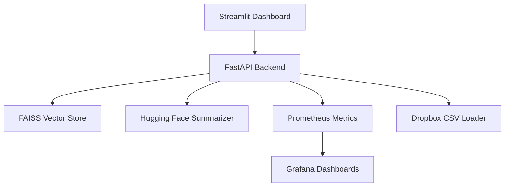

# 📊 GenAI Complaint Dashboard

A full-stack NLP assistant that retrieves and summarizes consumer complaints using semantic search and LLMs. Built with FastAPI, FAISS, and Hugging Face Transformers, and monitored in real time using Prometheus and Grafana. Includes a modular Streamlit dashboard with hierarchical filtering and clean UI design.

---

## 🌟 Project Highlights

- 🔍 **Semantic Search**: Retrieve relevant complaints using FAISS and sentence-transformers
- 🧠 **LLM Summarization**: Generate concise summaries with Hugging Face Transformers
- 📊 **Interactive Dashboard**: Filter complaints by state, company, and ID with Streamlit
- 📈 **Real-Time Monitoring**: Prometheus metrics and Grafana dashboards for observability
- 🧪 **Modular Architecture**: Clean separation of backend, frontend, and monitoring layers
- ☁️ **Cloud-Ready**: Dropbox integration for large CSVs, FastAPI designed for Render/Railway deployment
- 🧠 **RAG Pipeline Integration**: Combines vector search with LLM summarization for contextual answers
- 📊 **Grafana Alerting**: Uptime and request rate dashboards with PromQL-based alerts
- 🧪 **CI/CD Pipeline**: Automated testing and deployment with unit tests and GitHub Actions

---

## 💼 Skills Demonstrated

- Python, pandas, regex, NLTK
- FAISS, sentence-transformers, Hugging Face Transformers
- FastAPI, Streamlit
- Prometheus, Grafana
- Git, GitHub, Git LFS
- Modular UI design and observability instrumentation
- Cloud deployment troubleshooting and API integration

---

## 🔗 Live Demo

👉 [Try the Streamlit Dashboard](https://sushma-reddy-garlapati-genai-complaint-dashboard.streamlit.app)

---

## 🧰 Tech Stack

### 🧠 Natural Language Processing
- **FAISS** – Vector similarity search for semantic retrieval  
- **sentence-transformers** – Embedding generation using pretrained models  
- **Hugging Face Transformers** – LLM-based summarization  
- **RAG Pipeline** – Combines FAISS retrieval with LLM generation for contextual answers  
- **NLTK** – Text preprocessing and tokenization

### ⚙️ Backend
- **FastAPI** – High-performance REST API framework  
- **Uvicorn** – ASGI server for running FastAPI  
- **Swagger UI** – Auto-generated interactive API documentation  
- **prometheus_fastapi_instrumentator** – Middleware for exposing metrics at `/metrics`  
- **Requests** – Internal API calls between frontend and backend

### 🎨 Frontend
- **Streamlit** – Interactive dashboard with modular UI  
- **Dropdown filters** – Hierarchical filtering by company, state, and complaint ID  
- **Dynamic tabs** – NLP summarizer, complaint explorer, company profile

### 📊 Monitoring & Observability
- **Prometheus** – Scrapes metrics from FastAPI endpoints  
- **Grafana** – Visualizes request rate, latency, uptime, and GC stats  
- **PromQL** – Custom queries for alerting and performance analysis  
- **Metrics exposed**:
  - `http_requests_total`
  - `faas_request_duration_seconds_sum`
  - `gc_objects_collected_total`
  - `python_info`

### 📁 Data Handling
- **Dropbox-hosted CSVs** – Cloud-accessible large datasets  
- **pandas** – Data cleaning, filtering, and preprocessing  
- **Regex** – Complaint text normalization and pattern matching

### 🧪 Testing & CI/CD
- **Pytest** – Unit testing for backend endpoints and logic  
- **GitHub Actions** – CI/CD pipeline for automated testing and deployment  
- **Linting & formatting** – Ensures clean, readable codebase

### 🚀 Deployment
- **Streamlit Cloud** – Public hosting for frontend dashboard  
- **Local FastAPI backend** – Cloud-ready for Render or Railway  
- **GitHub Pages** – Project landing page and documentation (optional)

### 🛠️ Tooling & DevOps
- **Git & GitHub** – Version control and collaboration  
- **Git LFS** – Handles large CSV files efficiently  
- **.gitignore, LICENSE, README** – Professional repo hygiene  
- **Modular repo structure** – Separation of concerns for frontend, backend, and monitoring


---

## 🏗️ System Architecture



## 🚀 Setup Instructions

### 🔧 Backend (FastAPI)

```bash
# Install dependencies
pip install -r requirements.txt

# Start FastAPI backend
uvicorn notebook.rag_api:app --host 0.0.0.0 --port 8000 --reload
```

### 🖥️ Frontend (Streamlit)

```bash
# Launch Streamlit dashboard
streamlit run notebook/app.py
```

### 📊 Monitoring (Prometheus + Grafana)

```bash
# Start Prometheus
prometheus --config.file=notebook/prometheus.yml

# Start Grafana (macOS example)
brew services start grafana
```

> Note: Prometheus scrapes metrics from FastAPI at `/metrics`. Grafana visualizes request rate, latency, and system health.

---

## 📊 Monitoring & Observability

This project includes full-stack observability:

- Metrics exposed via `/metrics` using `prometheus_fastapi_instrumentator`
- Prometheus queries track request rate, latency, and uptime
- Grafana dashboards visualize system health over time
- Includes PromQL queries for:
  - `http_requests_total`
  - `faas_request_duration_seconds_sum`
  - `gc_objects_collected_total`
  - `rate(faas_requests_total{faas_function=~".*"}[1m])`
  - `sum(rate(faas_requests_total[1m])) by (function)`

---

## 🖼️ Screenshots

### 📊 Dashboard Overview  


### 🧠 NLP Query Summarizer  


### 🆔 Complaint ID Lookup  


### 🏦 Company Profile  


### 📈 Prometheus Metrics Endpoint  


### 🔎 Prometheus Query Console  


### 📊 Grafana Request Rate  


### 📜 FastAPI Swagger Docs  


---

## 🔮 Future Improvements

- 🌐 Deploy FastAPI backend to Render or Railway for full cloud integration
- 🔐 Add authentication for complaint lookup and summarization
- 📦 Package as a pip-installable module for reuse
---

## 📁 Repository

👉 [GitHub: genai-complaint-dashboard](https://github.com/sushma-reddy-garlapati/genai-complaint-dashboard)

---

## 🧑‍💻 Author

**Sushma Reddy Garlapati**  
Aspiring NLP Engineer | Backend Developer | Open-source Contributor  
Focused on building recruiter-ready GenAI demos with real-time observability and clean UI design.

📫 Contact: [LinkedIn](https://www.linkedin.com/in/sushma-reddy-garlapati) | [GitHub](https://github.com/sushma-reddy-garlapati)

---
```
