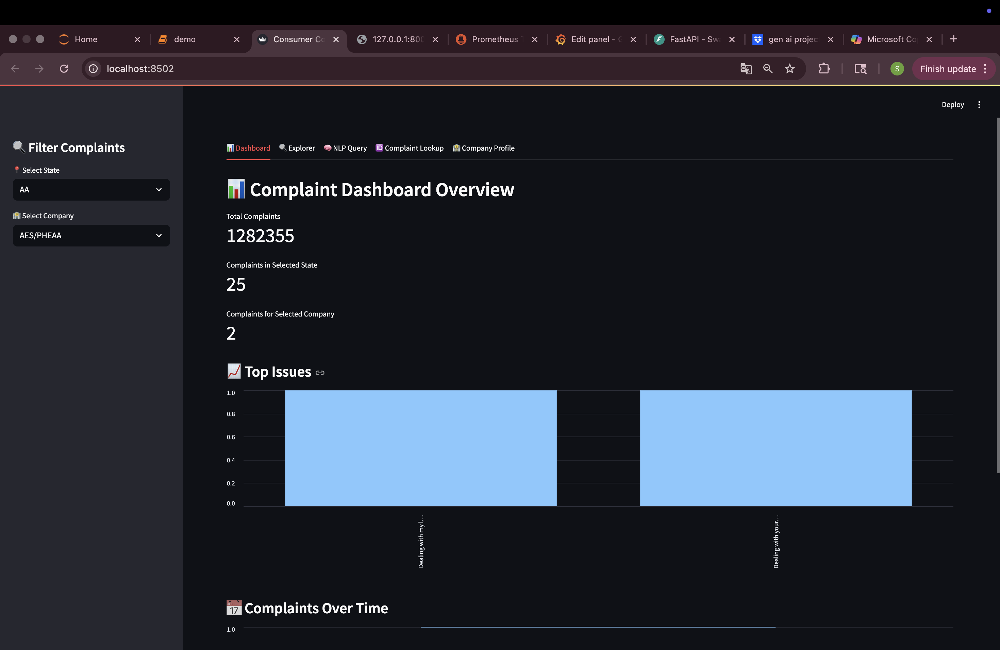
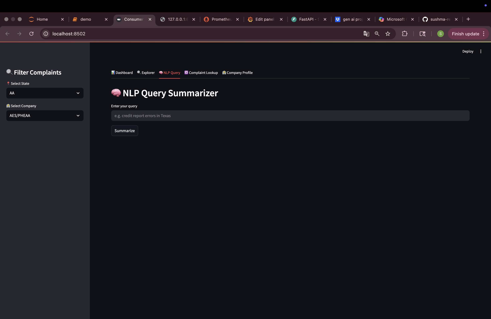
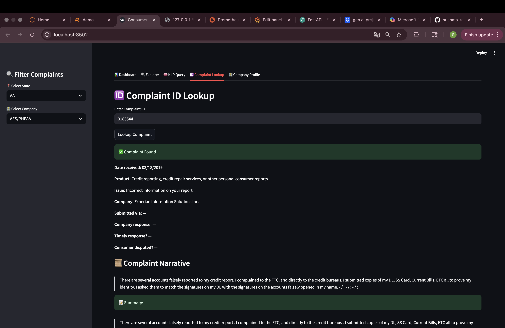
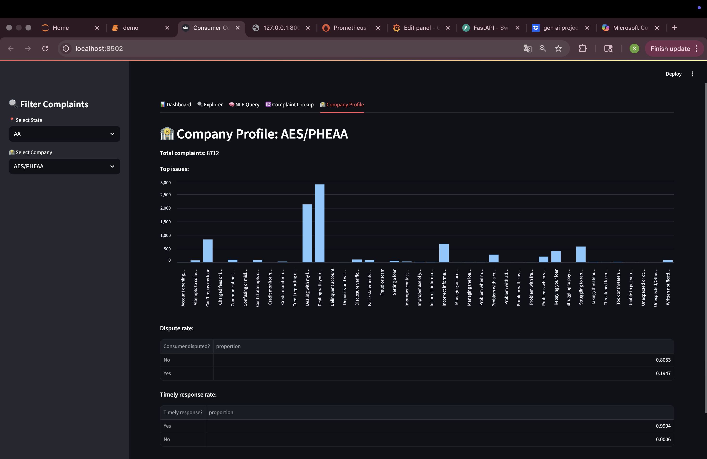
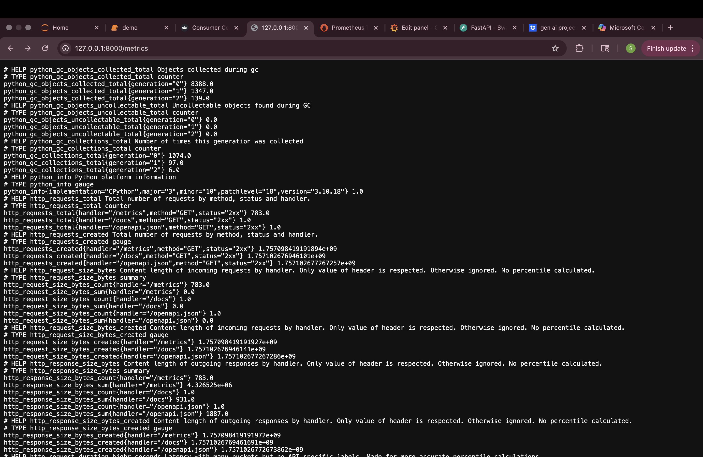
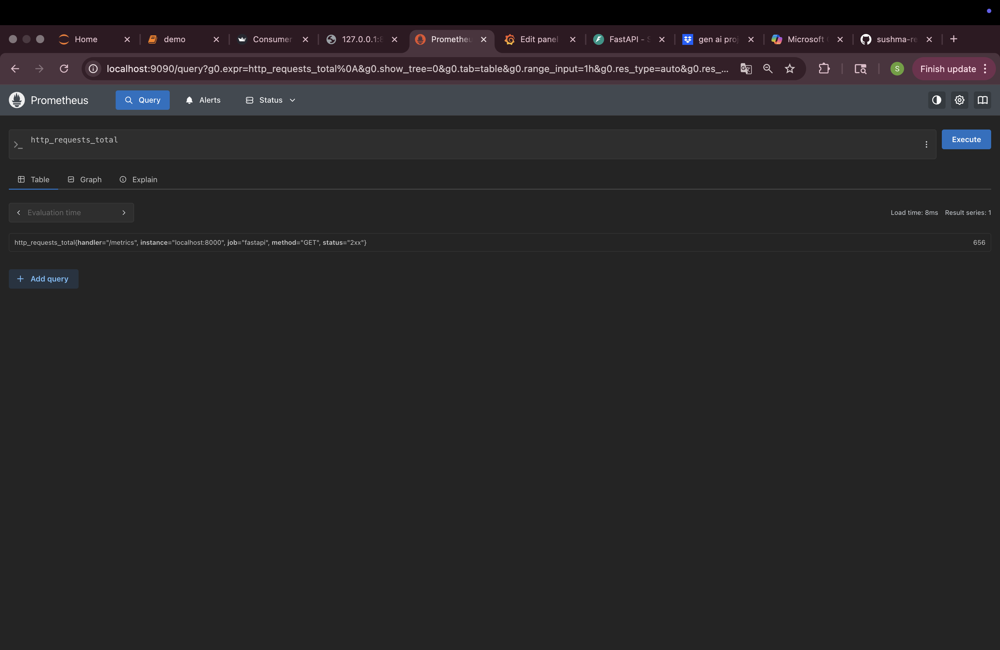
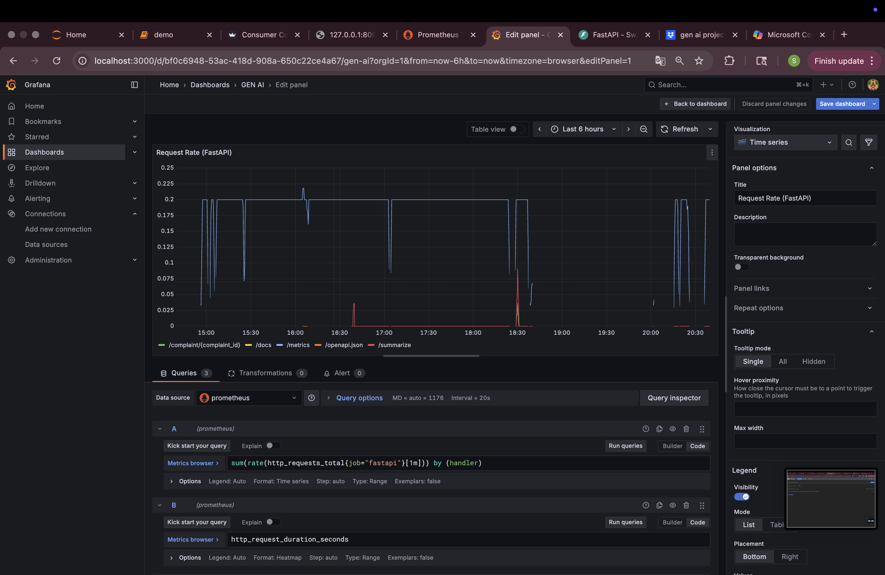
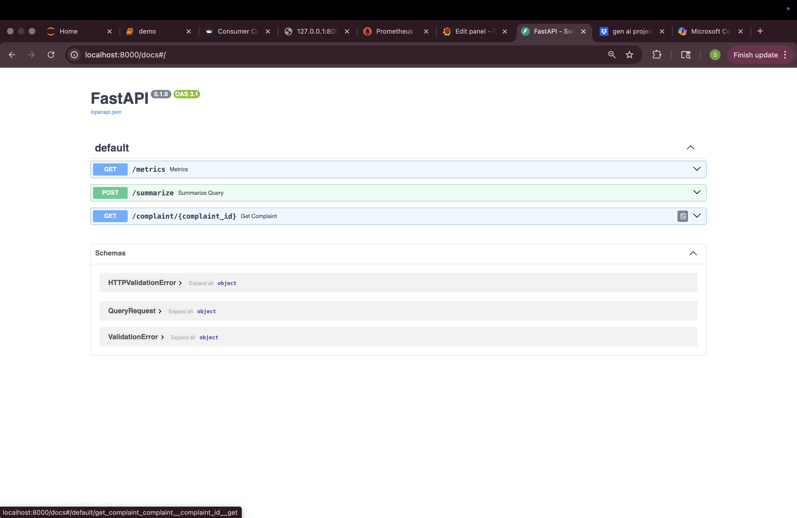

# 📊 GenAI Complaint Dashboard

A full-stack NLP assistant that retrieves and summarizes consumer complaints using semantic search and LLMs. Built with FastAPI, FAISS, and Hugging Face Transformers, and monitored in real time using Prometheus and Grafana. Includes a modular Streamlit dashboard with hierarchical filtering and clean UI design.

## 💼 Skills Demonstrated

- Python, pandas, regex, NLTK
- FAISS, sentence-transformers, Hugging Face Transformers
- FastAPI, Streamlit
- Prometheus, Grafana
- Git, GitHub, Git LFS
- Modular UI design and observability instrumentation

## 🔗 Live Demo

👉 [Try the Streamlit Dashboard](https://sushma-reddy-garlapati-genai-complaint-dashboard.streamlit.app)


## 🚀 Setup Instructions

```bash
# Start FastAPI backend
uvicorn notebook.rag_api:app --reload

# Launch Streamlit dashboard
streamlit run notebook.app.py

# Start Prometheus
prometheus --config.file=notebook/prometheus.yml

# Start Grafana (macOS example)
brew services start grafana
```
## 🖼️ Screenshots

### 📊 Dashboard Overview  


### 🔍 Complaint Explorer  


### 🧠 NLP Query Summarizer  


### 🆔 Complaint ID Lookup  


### 🏦 Company Profile  


### 📈 Prometheus Metrics Endpoint  


### 🔎 Prometheus Query Console  


### 📊 Grafana Request Rate  


### 📜 FastAPI Swagger Docs  


